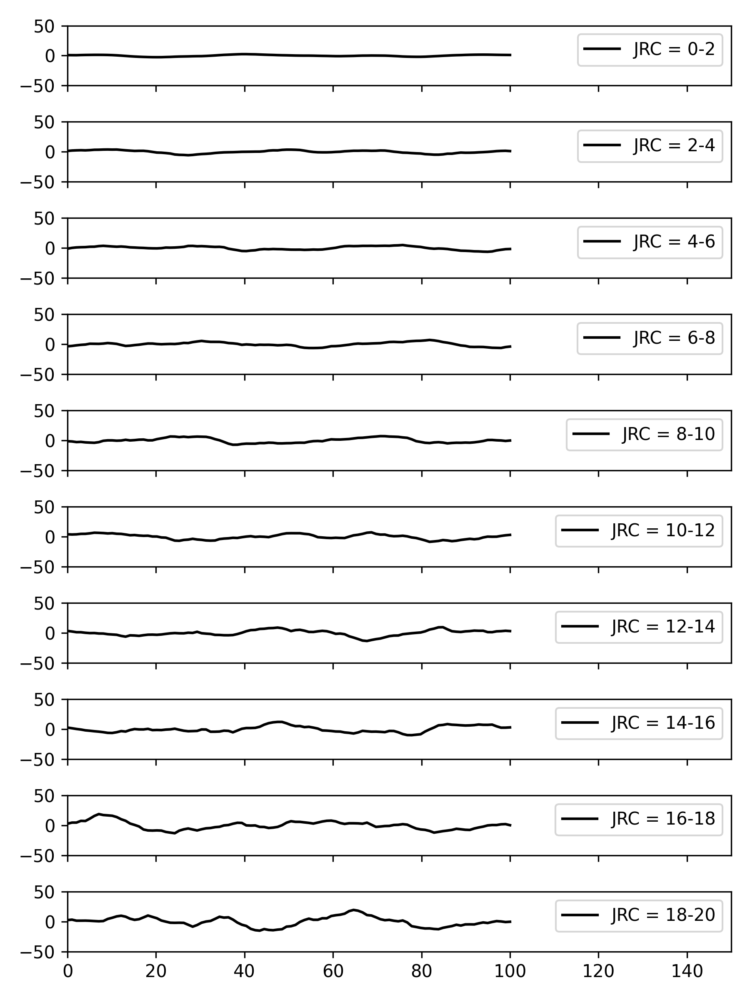
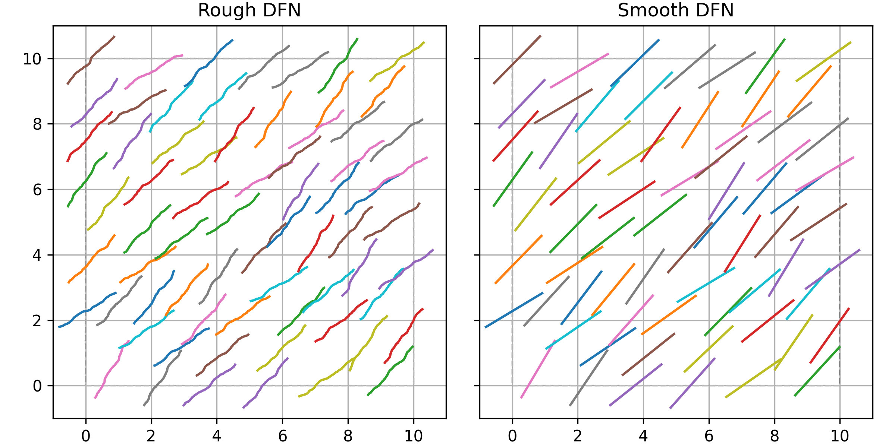
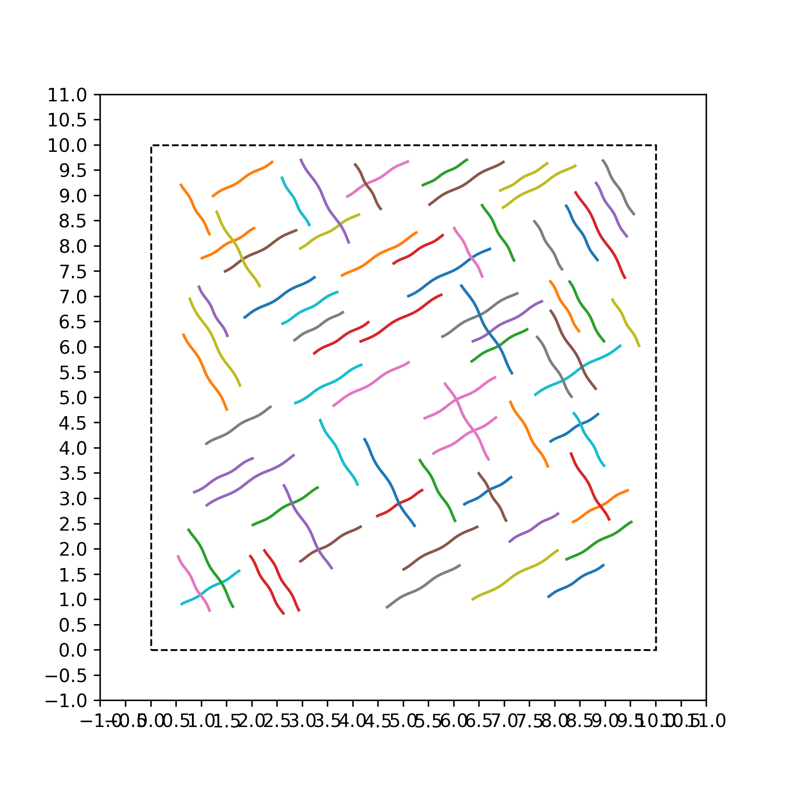
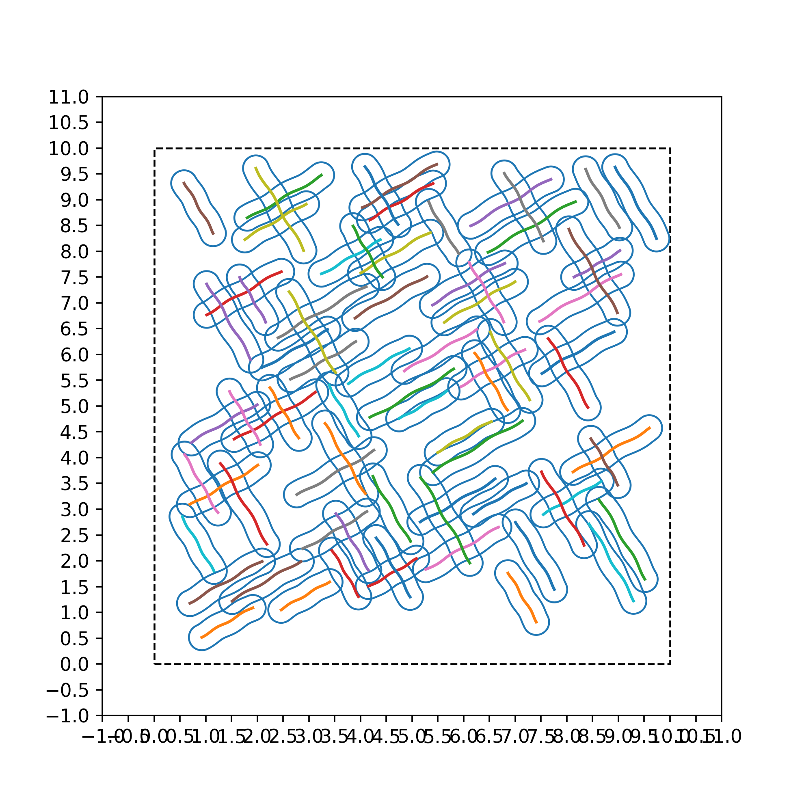
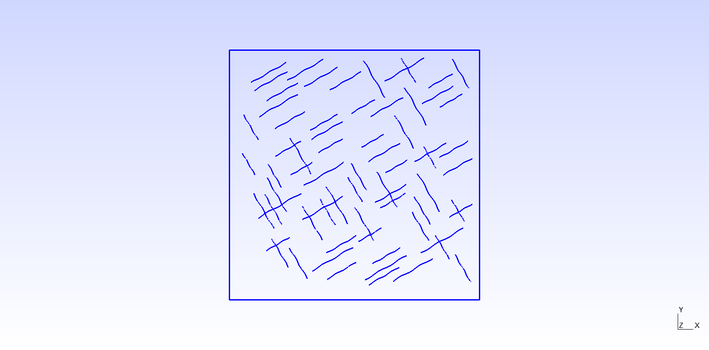
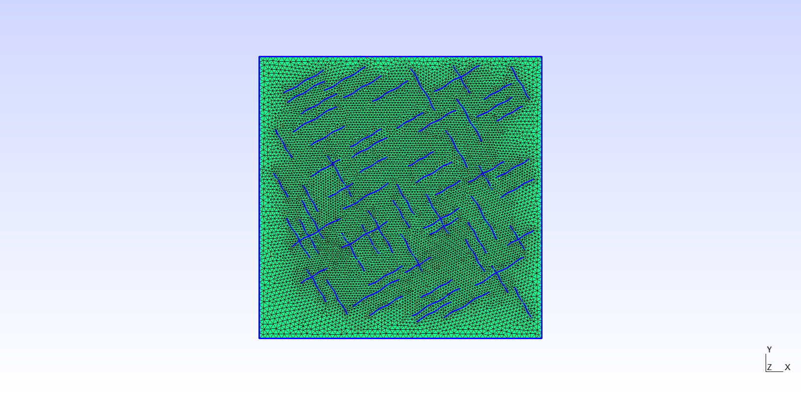
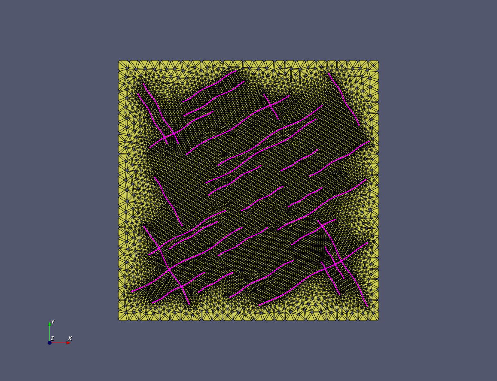

# Two-dimensional Rough Discrete Fracture Network (RDFN) generator

## Introduction

In order to realistically simulate the morphology of natural fractures embeded in the engineering rock masses, a Fourier transform approach is utilized to controllably reconstruct the fracture surface roughness. Combined with Monte-Carlo sampling technique, Rough Discrete Fracture Networks (RDFNs) can be statistically recomplished, which plays a fundamental role in computational rock mechanics and rock engineering.

We intended to incorparate the reconstructed RDFN into our in-house code series QFDEM/YFDEM to study the problem of hydraulic fracturing, by means of the mesh-based methods including Finite Element Method (FEM), Finite Difference (FDM) and Finite Volume Method (FVM). The current repository is belong to the preprocessing module of further numerical analysis.

## Requirements

The functionality is implementd in Python, along with common third party libraris, which consists of [numpy](https://numpy.org/), [matplotlib](https://matplotlib.org/), [shapely](https://shapely.readthedocs.io/en/stable/manual.html) and [gmsh](https://gmsh.info/). You can easily install these pacakages like this:

```shell
pip install numpy, matplotlib, shapely, gmsh
```

## Big Picture

A high quality of triangulation of the reconstructed RDFN is indispensible to further numerical simulation. Thus, the spatial distribution of generated fractures is necessary to avoid the closeness or even overlap between different fractures in the process of random sampling. Here are the main steps involved in the algorithm:

1. Input the magnitudes of characteristic harmonics ($d_2, d_3, d_8$) and randomly sample their initial phases ($\phi_2, \phi_3, \phi_8$). Based on these information, other harmonics can be empirically calculated.

2. Obtain the rough fracture surface profile using the Invert Discrete Fourier Transfer (IDFT). There is a good corresponding relationship between the classic JRC and reconstructed rough fractures.

3. Allocate the rough fracture one by one to assembly the rough discrete fracture network (RDFN). A data structure is intentionally designed to avoid very closeness or overlap cases.

4. RDFN is written into gmsh script file (.geo) and then trangulated by specifing mesh sizes. Mark the fracture and rock masses as two distinct physical groups.

5. Set up FDEM numerical model by our propriatary code QFDEM, including insert zero-thickness cohesive elements, assign material constritutive relations and prescribe boundary conditions, etc.

## Demonstration


Fig. 1 Reconstructed rough fracture.

---



Fig. 2 Fracture network with smooth and rough fractures

--




Fig. 3 One by one fracture sampling.

--




Fig. 4 Write into gmsh and trangulate.

--


Fig. 5 FDEM model for RDFN.

--
