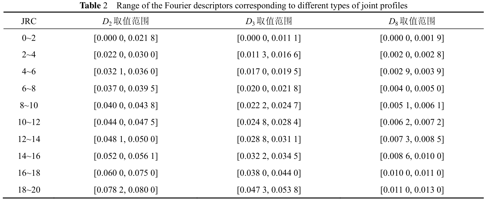

# 基于离散傅里叶变换方法的粗糙节理网络(DFN)重构

## 1. 傅里叶级数的不同形式

- **正弦-余弦形式**

对于满足*Dirichlet*定理的周期函数$f(x)=f(x+T)$，可以由一组正弦和余弦函数的加权和表示：

$$
\begin{equation}
f(x)={a_0} + \sum_{n=1}^{\infty}{[a_ncos(n\omega_0x) + b_nsin(n\omega_0x)]}
\end{equation}
$$
根据三角函数空间的正交性，上式中的系数$a_n$和$b_n$可由以下计算

$$
\begin{equation}
\begin{cases}
a_0 = \frac{1}{T}\int_{0}^{T} f(x)dx \\
a_n = \frac{2}{T}\int_{0}^{T} f(x)cos(n\omega_0x)dx \\
b_n = \frac{2}{T}\int_{0}^{T} f(x)sin(n\omega_0x)dx
\end{cases}
\end{equation}
$$

- **振幅-相位形式**

根据三角函数恒等式，式(1)可以表示为如下的振幅-相位形式：
$$
\begin{equation}
f(x) = d_0 + \sum_{n=1}^\infty d_n \cos(n\omega_0 x + \varphi_n)
\end{equation}
$$

振幅$d_n$和相位$\varphi_n$与正弦-余弦形式的系数关系如下：
$$
\begin{equation}
\begin{cases}
d_0 = a_0 \\
d_n = \sqrt{a_n^2 + b_n^2} \\
\varphi_n = arctan(-\frac{b_n}{a_n})
\end{cases}
\end{equation}
$$

- **复指数形式**

利用欧拉公式$e^{i\theta} = cos(\theta) + isin(\theta)$，将正弦和余弦函数用复指数替换，可得傅里叶级数的复指数表达：
$$
\begin{equation}
f(x) = \sum_{n=-\infty}^{+\infty} c_n e^{in\omega_0 x} \\
\end{equation}
$$

系数$c_n$与正弦-余弦形式的系数关系如下：
$$
\begin{equation}
\begin{cases}
c_0 = a_0 \\
c_n = (a_n - ib_n)/2 && if(n > 0)\\
c_n = (a_{-n} + ib_{-n})/2 && if(n < 0)
\end{cases}
\end{equation}
$$

---

## 2. 离散傅里叶变换(DFT)

如果将单个节理看作式离散采样的周期函数，则可以利用离散傅里叶变换(DFT)和离散傅里叶逆变换(IDFT)实现粗糙节理面的重构。

离散傅里叶变换(DFT)由下式计算：

$$
\begin{equation}
X_k = \sum_{n=0}^{N-1}{x_n\cdot e^{-i2\pi{kn/N}}} = \sum_{n=0}^{N-1}{x_n[cos(2\pi{kn/N}) -i\cdot sin(2\pi{kn/N})]}
\end{equation}
$$

离散傅里叶的逆变换(IDFT)由下式计算：

$$
\begin{equation}
x_n = \frac{1}{N}\sum_{k=0}^{N-1}{X_k\cdot e^{i\cdot 2\pi{kn/N}}}
\end{equation}
$$

**注意：** DFT的系数为1， 而IDFT的系数为$1/N$， 这和上述傅里叶级数的系数位置不同。这关系到不同形式的傅里叶级数之间的系数转换，特别是在单独使用`numpy.fft.ifft`时，如何提供正确的频谱信息至关重要，尤其需要注意直流分量$c_0$和Nyquist频率系数$c_{N//2}$。

---

## 3. 粗糙节理面重构

有研究学者$^{1,2}$通过对实地采集的大量节理面形貌特征进行傅里叶分析，得到了傅里叶特征参数的统计回归公式：

$$
\begin{equation}
\begin{cases}
D_n = 2^{\alpha log_2(n/3) + log_2(D_3)} && if(3<n<8) \\
D_n = 2^{\beta log_2(n/8) + log_2(D_8)} && if(n>8)
\end{cases}
\end{equation}
$$

其中，$\alpha=-1.4042, \beta=-1.3489.$ 因此，通过给定$D_1=0, D_2,D_3,D_8$，可以得到节理面的完整频域信息。研究表明，$D_2$和$D_3$决定了节理面较大范围的起伏度，而$D_8$则反映了局部小尺度上的粗糙程度。$D_n$的取值与Barton标准节理的JRC的对应关系如下表所示：

通过IDFT逆向重构的节理面与Barton$^3$定义的标准节理JRC的对比结果如下：

由上可知，通过离散傅里叶方法可以定量且真实地重构出实际节理面的形貌特征
---

## 4. 粗糙离散裂隙网络(RDFN)

实际工程节理岩体往往含有大量的不同尺度的不连续面，如节理、层理、断层等，由此形成的复杂裂隙网络对工程岩体的力学和水力特性具有重要影响。因此，真实地模拟出岩体工程中不连续面的粗糙性和连通性是岩石工程数值分析的前提。根据上述对单个节理面形貌特征的定量控制，本小节利用Monte-Carlo方法来模拟粗糙裂隙网络。

简单起见，假设裂隙的尺寸与倾角均服从均匀分布，裂隙的位置分别采用随机抽样和**快速泊松圆盘抽样**$^4$得到，结果如下图所示。

模拟区域大小为$10m \times 10m$, 裂隙数量为$64$，裂隙倾角范围为$[\frac{\pi}{6}, \frac{\pi}{4}]$, 裂隙尺寸范围为$[1.0m, 2.0m]$。可以看出，随机抽样得到的DFN在问题域中的分布有明显的**聚集特征**，是一种伪随机分布，而泊松圆盘抽样则能够得到更加符合均匀分布的DFN。

> [1]: Nie, Zh., Wang, X., Huang, Dl. et al. Fourier-shape-based reconstruction of rock joint profile with realistic unevenness and waviness features. J. Cent. South Univ. 26, 3103–3113 (2019). <https://doi.org/10.1007/s11771-019-4239-8>
>
> [2]: 赵炼恒,于诚浩,黄栋梁,等.基于离散傅立叶变换的岩石节理形貌分析与随机重构[J].铁道科学与工程学报, 2017, 14(8):9.DOI:CNKI:SUN:CSTD.0.2017-08-006.
>
> [3]: Barton, N., Choubey, V. The shear strength of rock joints in theory and practice. Rock Mechanics 10, 1–54 (1977). <https://doi.org/10.1007/BF01261801>
>
> [4]: Bridson, R. (2007). Fast Poisson disk sampling in arbitrary dimensions. International Conference on Computer Graphics and Interactive Techniques.

---

## 5. 网格剖分与数值模拟

在获得了粗糙节理的形貌特征以后，下一步是利用`FDEM`方法进行水力压裂的相关模拟研究。其中有一个关键问题是如何得到能够进行模拟的网格剖分？
***(未完待续)***
